# Ticketing Platform



좌석 조회, 대기열 토큰, 예약·주문, 결제·티켓 발급의 요청 흐름입니다. 움직이는 점은 요청·응답·이벤트를 나타냅니다.



동일 좌석에 들어온 **20건의 동시 예약 요청 → 1건 성공 / 19건 충돌 거절**을 보여줍니다. 화면의 첫 번째 고객은 설명용 예시이며, 실제 성공 고객은 락 획득 순서에 따라 달라집니다.



최초 결제 완료 후 같은 `Idempotency-Key`·주문·금액으로 재시도하면 기존 결제 결과를 반환합니다. 다른 주문이나 금액에 키를 재사용하면 `409 CONFLICT`로 거절합니다.

> 애니메이션은 현재 구현의 동작을 설명하는 반복 시각화이며 실측 트래픽 그래프가 아닙니다. 대기열은 순번 토큰 발급·재사용·취소 기능이며 자동 입장 제한은 구현되어 있지 않습니다. 결제 장면은 최초 요청 완료 이후의 재시도를 나타냅니다.

| 검증 항목 | 환경 및 시나리오 | 결과 |
| --- | --- | --- |
| 테스트 환경 | Windows 11 Pro, OpenJDK 21, Docker 27.5.1, Gradle 9.5.1 | 통과 |
| 데이터베이스 | Testcontainers 기반 PostgreSQL, Flyway 마이그레이션 적용 | 통과 |
| 동시 좌석 예약 | 20명의 고객이 동일 좌석을 동시에 예약 요청 | 1건 성공, 19건 충돌 거절 |
| 동시성 제어 | `PESSIMISTIC_WRITE` 잠금으로 좌석 중복 선점 방지 | 중복 예약 0건 |

고동시성 환경에서 좌석 조회, 임시 예약, 주문 생성, 결제 승인, 티켓 발급까지 이어지는 티켓팅 구매 플로우를 구현한 포트폴리오 프로젝트입니다.

핵심 목표는 단순 CRUD가 아니라 실무에서 문제가 되는 좌석 중복 판매, 예약 만료, 결제 재시도, 트랜잭션 일관성을 작은 도메인 안에서 명확하게 다루는 것입니다.

## 핵심 기능

- 공연별 좌석 조회
- 좌석 임시 예약 및 5분 홀드
- 비관적 락 기반 좌석 선점
- 예약 기반 주문 생성
- `Idempotency-Key` 기반 결제 재시도 방어
- 결제 승인 시 예약 확정, 주문 결제 완료, 좌석 판매, 티켓 발급을 하나의 트랜잭션으로 처리
- 만료된 예약 배치 해제
- Redis 기반 좌석 조회 캐시
- Redis Sorted Set 기반 대기열 토큰 발급
- Redis 대기열 토큰 취소
- Kafka 기반 티켓 발급 이벤트 발행
- Flyway 기반 스키마 관리
- Actuator, Prometheus endpoint 노출

## 기술 스택

- Java 21
- Spring Boot 4.1
- Spring MVC
- Spring Data JPA
- Spring Security
- PostgreSQL 17
- Redis 7
- Kafka 3.7
- Flyway
- Testcontainers
- Gradle
- Docker Compose

## 실행

```bash
docker compose up -d
.\gradlew.bat bootRun
```

macOS/Linux:

```bash
docker compose up -d
./gradlew bootRun
```

기본 데모 공연 ID:

```text
11111111-1111-1111-1111-111111111111
```

## API 예시

좌석 조회:

```http
GET /api/v1/performances/11111111-1111-1111-1111-111111111111/seats
```

좌석 임시 예약:

```http
POST /api/v1/performances/11111111-1111-1111-1111-111111111111/reservations
Content-Type: application/json

{
  "customerId": "22222222-2222-2222-2222-222222222222",
  "seatIds": ["aaaaaaaa-aaaa-aaaa-aaaa-aaaaaaaaaaa1"]
}
```

주문 생성:

```http
POST /api/v1/reservations/{reservationId}/orders
Content-Type: application/json

{
  "customerId": "22222222-2222-2222-2222-222222222222"
}
```

결제 승인:

```http
POST /api/v1/orders/{orderId}/payments
Idempotency-Key: payment-request-001
Content-Type: application/json

{
  "amount": 120000
}
```

대기열 토큰 발급:

```http
POST /api/v1/performances/11111111-1111-1111-1111-111111111111/waiting-room/tokens
Content-Type: application/json

{
  "customerId": "22222222-2222-2222-2222-222222222222"
}
```

대기열 토큰 취소:

```http
DELETE /api/v1/performances/11111111-1111-1111-1111-111111111111/waiting-room/tokens/22222222-2222-2222-2222-222222222222
```

## 테스트

```bash
.\gradlew.bat test
```

## 설계 포인트

- 좌석 선점은 `PESSIMISTIC_WRITE` 락과 정렬된 조회로 중복 판매 가능성을 줄입니다.
- 좌석 조회 결과는 Redis에 짧게 캐싱하고, 예약/만료/결제 상태 변경 시 캐시를 무효화합니다.
- 대기열 토큰은 Redis Sorted Set에 순번 기반 score로 저장하고, 고객별 member 매핑을 Hash에 저장해 재발급과 취소를 처리합니다.
- 예약은 `HELD -> CONFIRMED` 또는 `HELD -> EXPIRED` 상태로 관리합니다.
- 결제 승인은 멱등키를 저장해 같은 요청의 재처리는 기존 결제 결과를 반환하고, 다른 주문/금액 재사용은 거절합니다.
- 결제 승인 트랜잭션에서 예약, 주문, 좌석, 티켓을 함께 변경해 구매 완료 상태의 원자성을 보장합니다.
- 티켓 발급 이벤트는 트랜잭션 커밋 이후 Kafka로 발행합니다.

## 애니메이션 재생성

GitHub README에서 바로 반복 재생되는 SVG 애니메이션을 사용합니다. 브라우저가 곡선 경로와 상태 전환을 직접 렌더링하므로 확대해도 선명하며, GIF의 고정 프레임 간격과 색상 제한이 없습니다. SVG에는 스크립트나 외부 이미지·폰트가 포함되지 않습니다.

Python 표준 라이브러리만으로 애니메이션을 재생성할 수 있습니다.

```bash
python docs/animations/render_traffic.py
```
